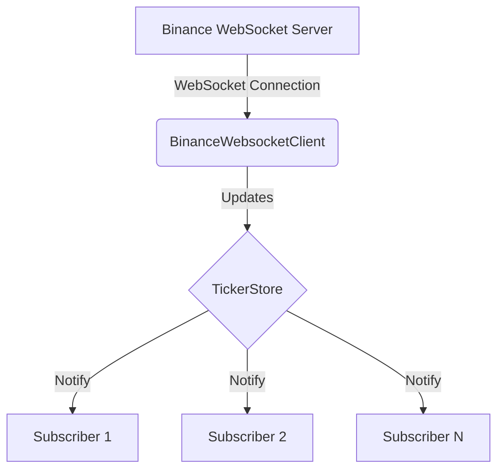
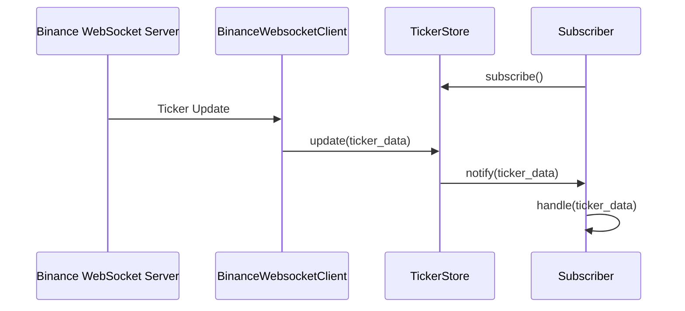

# Binance WebSocket Client

This project implements a WebSocket client for the Binance cryptocurrency exchange, specifically for receiving real-time ticker updates for the BTCUSDT trading pair.

## Features

- Real-time WebSocket connection to Binance
- Ticker data storage and retrieval
- Subscription system for receiving updates
- Configurable filtering of updates

## Prerequisites

- Elixir 1.17 or later
- Erlang (SMP,ASYNC_THREADS) (BEAM) emulator version 14.2.5
- Erlang/OTP 26
- IntelliJ IDEA Version 2023.3.7 with Elixir plugin (optional)
- Homebrew
- asdf for Elixir version management

## Installation

1. Clone the repository:
   ```bash
   git clone https://github.com/arturogonzalezm/binance_websocket_client.git
   cd binance_websocket_client
   ```

2. Fetch dependencies:
   ```bash
   mix deps.get
   ```

3. Compile the project:
   ```bash
   mix compile
   ```

4. Test:
   ```bash
   mix test
   ```

## Usage

To start the application:

```bash
iex -S mix
```

```elixir
Application.stop(:binance_websocket_client)
```

```elixir
Application.start(:binance_websocket_client)
```

This will start the WebSocket client and connect to Binance's WebSocket server.

### Creating a Subscriber

To receive updates:

```elixir
handler = fn ticker -> IO.inspect(ticker, label: "Received ticker update") end
{:ok, pid} = BinanceWebsocketClient.Subscriber.start_link(handler: handler)
```

To filter updates:

```elixir
filter = fn ticker -> String.to_float(ticker["P"]) > 1.0 end
{:ok, pid} = BinanceWebsocketClient.Subscriber.start_link(handler: handler, filter: filter)
```

## Architecture

### Flowchart



### Sequence Diagram



## Running Tests

To run the test suite:

```
mix test
```

## License

This project is licensed under the MIT License - see the [LICENSE.md](LICENSE.md) file for details.