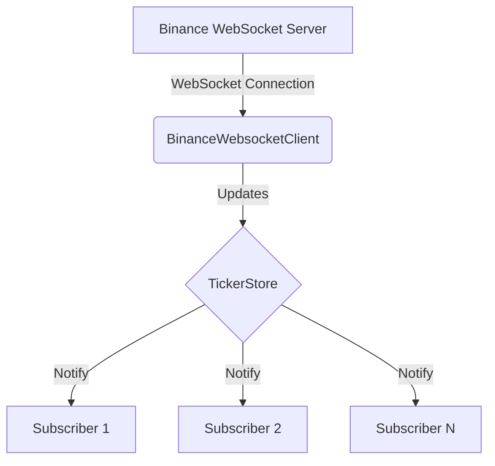
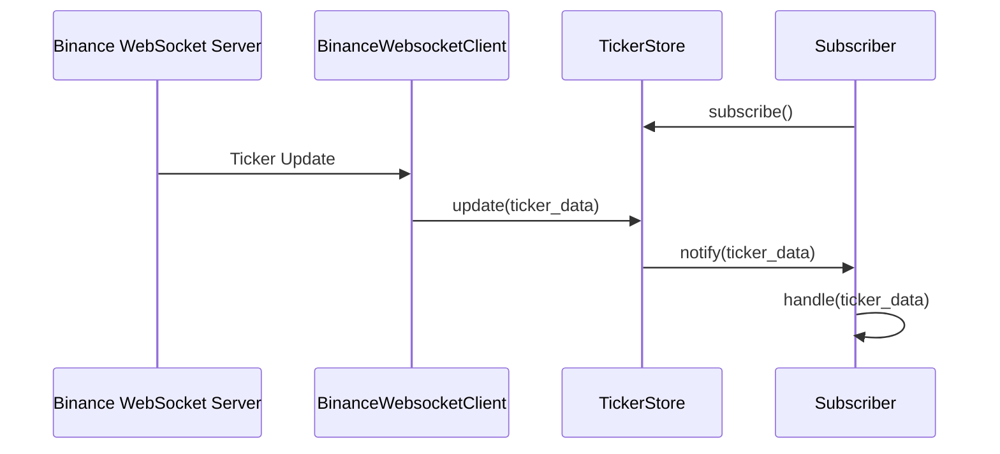

# Binance WebSocket Client

This project implements a WebSocket client for the Binance cryptocurrency exchange, specifically for receiving real-time ticker updates for the BTCUSDT trading pair.

## Features

- Real-time WebSocket connection to Binance
- Ticker data storage and retrieval
- Subscription system for receiving updates
- Configurable filtering of updates

## Prerequisites

- Elixir 1.17 or later
- Erlang (SMP,ASYNC_THREADS) (BEAM) emulator version 14.2.5
- Erlang/OTP 26
- IntelliJ IDEA Version 2023.3.7 with Elixir plugin (optional)
- Homebrew
- asdf for Elixir version management

## Installation

1. Clone the repository:
   ```bash
   git clone https://github.com/arturogonzalezm/binance_websocket_client.git
   cd binance_websocket_client
   ```

2. Fetch dependencies:
   ```bash
   mix deps.get
   ```

3. Compile the project:
   ```bash
   mix compile
   ```

4. Test:
   ```bash
   mix test
   ```

## Usage

To start the application:

```bash
iex -S mix
```

```elixir
Application.stop(:binance_websocket_client)
```

```elixir
Application.start(:binance_websocket_client)
```

This will start the WebSocket client and connect to Binance's WebSocket server.

### Getting the latest BTCUSDT ticker

After starting the app, at any time you can fetch the most recent ticker payload the client received from Binance:

```elixir
BinanceWebsocketClient.latest()
# => %{"e" => "24hrTicker", "s" => "BTCUSDT", ...}
```

### Creating a Subscriber

To receive real-time updates as they arrive:

```elixir
handler = fn ticker -> IO.inspect(ticker, label: "Received ticker update") end
{:ok, pid} = BinanceWebsocketClient.subscribe(handler)
```

To filter updates (for example, only when 24h change percent > 1%):

```elixir
filter = fn ticker -> String.to_float(ticker["P"]) > 1.0 end
{:ok, pid} = BinanceWebsocketClient.subscribe(handler, filter: filter)
```

## Architecture

### Flowchart


```mermaid
graph TD
    A[Binance WebSocket Server] -->|WebSocket Connection| B(BinanceWebsocketClient)
    B -->|Updates| C{TickerStore}
    C -->|Notify| D[Subscriber 1]
    C -->|Notify| E[Subscriber 2]
    C -->|Notify| F[Subscriber N]
```

### Sequence Diagram


```mermaid
sequenceDiagram
    participant Binance as Binance WebSocket Server
    participant Client as BinanceWebsocketClient
    participant Store as TickerStore
    participant Sub as Subscriber

    Sub->>Store: subscribe()
    Binance->>Client: Ticker Update
    Client->>Store: update(ticker_data)
    Store->>Sub: notify(ticker_data)
    Sub->>Sub: handle(ticker_data)
```

## Running Tests

To run the test suite:

```
mix test
```

## TODO: 
- Dockerise the Application
- Add docker-compose file
- Add CI/CD pipeline
- Add more tests
- Add InfluxDB for storing ticker data
- Add Grafana for visualising ticker data
- Add Prometheus for monitoring the application
- Add Kubernetes for deploying the application
- Add Helm for managing the Kubernetes deployment
- Add Terraform for managing the infrastructure
- Add Ansible for managing the configuration
- Add Jenkins for automating the CI/CD pipeline
- Add SonarQube for code quality analysis
- Add ELK Stack for log management
- Add Jaeger for distributed tracing
- Add OpenTelemetry for observability
- Add Sentry for error tracking
- Add New Relic for application performance monitoring
- Add Datadog for infrastructure monitoring
- Build a front-end for visualising the data in real-time using Phoenix LiveView

## Phoenix Channels Frontend

A minimal Phoenix Endpoint with Channels is included so you can consume real-time BTCUSDT ticker updates over WebSockets.

- Endpoint: ws://localhost:4000/socket
- Channel: "ticker:btcusdt"
- Events:
  - latest: pushed once on join with the current ticker if available
  - update: pushed on every new ticker update from Binance

### How to run the endpoint

1. Fetch new dependencies and compile:
   ```bash
   mix deps.get
   mix compile
   ```
2. Start the application (this also starts the Phoenix endpoint):
   ```bash
   iex -S mix
   ```

You should now have a WebSocket server running at ws://localhost:4000/socket.

### JavaScript usage (browser)

You can use Phoenix's JavaScript client to connect and receive updates. Example using a CDN:

```html
<!doctype html>
<html>
  <head>
    <meta charset="utf-8" />
    <title>BTCUSDT Ticker</title>
    <script src="https://unpkg.com/phoenix@1.7.14/priv/static/phoenix.min.js"></script>
  </head>
  <body>
    <pre id="log"></pre>
    <script>
      const log = (msg, data) => {
        const el = document.getElementById("log");
        el.textContent += `\n${msg} ${data ? JSON.stringify(data) : ''}`;
      };

      const socket = new window.Phoenix.Socket("ws://localhost:4000/socket", { params: {} });
      socket.connect();

      const channel = socket.channel("ticker:btcusdt", {});

      channel.on("latest", (payload) => log("latest:", payload));
      channel.on("update", (payload) => log("update:", payload));

      channel.join()
        .receive("ok", () => log("joined ticker:btcusdt"))
        .receive("error", resp => log("join error:", resp));
    </script>
  </body>
</html>
```

### Elixir usage (via Phoenix.ChannelTest / clients)

From Elixir, you can also write a small client using Phoenix Channels protocol libraries, but for most frontend uses, the JS client above is recommended.

Notes:
- The WebSocket server only exposes the channel and does not serve HTML pages.
- The topic is currently fixed to BTCUSDT. If you expand to multiple pairs, broadcast to corresponding topics like "ticker:ethusdt".

## License

This project is licensed under the MIT License - see the [LICENSE.md](LICENSE.md) file for details.